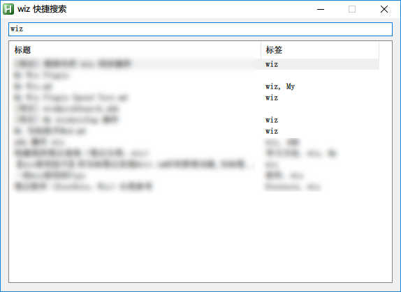

# wiz 快速搜索插件

wiz（为知笔记）快速搜索插件，仅支持 windows。

## 使用说明

### 安装

以插件形式安装：下载并安装 `wizQuickSearch.wizplugin`，然后在 wiz 菜单 `工具->wiz快速搜索` 点击启动。

也可直接下载源文件，放在独立目录，点击 `wizQuickSearch.exe` 启动。

注意：wiz 关闭后会自动退出，重新打开 wiz 也要重新启动本工具。

### 使用

启动后，使用按键 `#q`（win键 + Q键） 打开搜索框搜索（支持拼音首字母）。
 - 直接搜索文档标题+标签
 - `@` 搜索文件夹
 - `#` 搜索标签
 - `*` 使用 acc 搜索（将被移除）

搜索框输入完成后：
 - `Up`、`Down` 直接切换选中条目
 - `Left`、`Right` 直接输入框移动
 - `Enter` 打开选中的文档
 - `Ctrl + Enter` 发送搜索到的列表到wiz